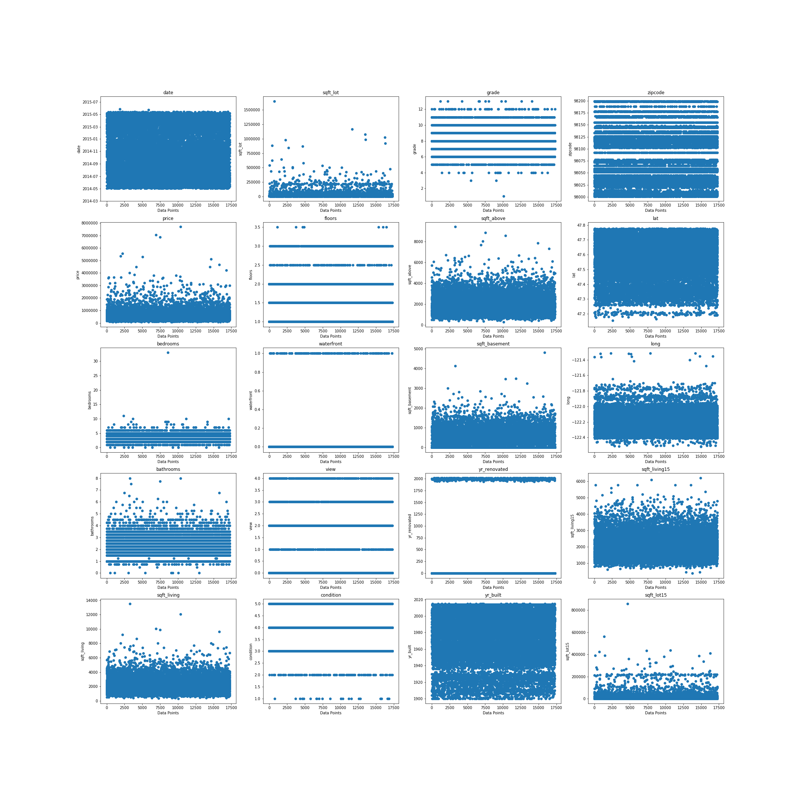

# Kings County Housing Pricing Predictor

**Authors**: [Ben Spilsbury](mailto:benjamin.spilsbury@gmail.com)

## Overview

The data science team has been tasked with creating a model to accurately predict the pricing of a home in the Seattle, Washington area. Housing sales information for Kings County, Washington from May, 2014 to May, 2015. A number of attributes were recorded for each house sale during that time (including square footage, zipcode, etc.); the data science team is analyzing 19 of these traits to ultimately develop a linear model that will predict house pricing. Overall, the team will explore these 19 traits, engineer other helpful features from these traits, and then select the combination of all these features that leads to the most accurate linear model using regression testing.

## Business Problem

Overall, the data science team is most concerned with developing an accurate model to predict housing prices in the Seattle area. However, three additional business questions are considered during the development of this model, which are ultimately answered at the conclusion of model development. These questions are as follows:

1. What housing feature is most beneficial to a house's selling price?
2. What housing feature is most harmful to a house's selling price?
3. What housing feature has the least effect on a house's selling price?

## Data

The data science team uses housing sales info from May, 2014 to May, 2015 in Kings County, Washington (Seattle area). As the team's model is supposed to predict pricing, that becomes the target of the data set. The remaining 19 traits of the data set (square footage, zipcode, etc.) are used as features to aid in the prediction of pricing. A brief visualization of all features and the target can be seen below:



## Methods

Data is first exploratively analyzed by generally graphing features and filtering out outliers. Next, extra features are developed (both linear and polynomial) in order to better define the data set. Features are then evaluated based on p-values and variance inflation factors to see if they should be precluded from the model. Three models are developed and the best, according to highest correlation coefficient and lowest root mean squared error, is elected of the final predictor for housing price.

## Results and Conclusion

A model was developed to predict housing pricing with an R^2 correlation of ~0.818 and a Z-score root mean squared error of ~0.432. In terms of the three originally posed business questions, the following conclusions were found:

1. The feature 'waterfront' (the residence has view to a waterfront) has the greatest positive effect on a house's selling price.
2. The feature 'condition_1' (residences that had the worst condition rating) has the greatest negative effect on a house's selling price.
3. The feature 'sqft_living_sq' (square footage of living space squared for higher weighting) has the least effect (positive or negative) on a house's selling price.

## For More Information

See the full analysis in the [Jupyter Notebook](./Seattle_House_Model_Process.ipynb).

For additional info, contact Ben Spilsbury at [benjamin.spilsbury@gmail.com](mailto:benjamin.spilsbury@gmail.com)

## Repository Structure

```
├── images
├── Working_Notebooks
├── Seatle_House_Model_Process.ipynb
├── house_model_final2.pickle
├── house_scaler_final2.pickle
├── housing_preds_ben_spilsbury.csv
├── kc_house_data_test_features.csv
├── kc_house_data_train.csv
└── README.md
